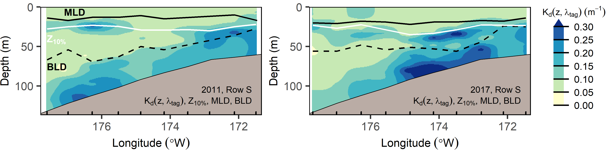

[](https://doi.org/10.5281/zenodo.3688864)

# trawllight
The trawllight R package contains functions to implement an algorithm that derives apparent optical properties from light measurements collected during NOAA Alaska Fisheries Science Center bottom-trawl surveys using trawl-mounted archival tags. A description of the light data collection protocol, algorithm subroutines, and algorithm performance is provided in Rohan et al. (2020) and Rohan et al. (2021).

<br><br>


<i>Transect along 60°N on the eastern Bering Sea shelf in 2017 showing the downwelling diffuse attenuation coefficient <i>K<sub>d</sub></i>(<i>z, tag</i>), mixed layer depth (MLD), bottom layer depth (BLD), and depth where downwelling irradiance is equal to 10% of irradiance and just beneath the sea surface (Z<sub>10%</sub>, i.e., optical depth = 2.3).

Average mixed layer depth and Z<sub>10%</sub> on the eastern Bering Sea continental shelf during summers (late May-early August) 2004 to 2017.

Near-bottom optical depth (i.e., optical depth ~2.5 m above the seafloor) in the eastern Bering Sea during summers 2004 to 2017. Increments of 2.303 correspond with an order of magnitude difference in downwelling irradiance.


# Installation

trawllight can be installed by starting R and running the following code. Installation requires the devtools package.

```
require(remotes)
remotes::install_github("afsc-gap-products/trawllight")
```

# Documentation

- [Decode and synchronize data](1_process_mk9.Rmd)
- [Run trawllight: QA/QC and derive apparent optical properties](2_run_trawllight.Rmd)
- [Generate data prodcts](3_make_data_product.Rmd)

# References
Rohan, S.K, Kotwicki, S., Britt, L.L., Laman, E.A., and Aydin, K. 2020. Deriving apparent optical properties from light measurements obtained using bottom-trawl-mounted archival tags. U.S. Dep. Commer., NOAA Tech. Memo. NMFS-AFSC-403, 91 p. [https://doi.org/10.25923/42yn-1q79](https://doi.org/10.25923/42yn-1q79)

Rohan, S.K., Kotwicki, S., Kearney, K.A., Schulien, J.A., Laman, E.A., Cokelet, E.D., Beauchamp, D.A., Britt, L.L., Aydin, K.Y., Zador, S.G., 2021. Using bottom trawls to monitor subsurface water clarity in marine ecosystems. Prog. Oceanogr. 194, 102554. [https://doi.org/10.1016/j.pocean.2021.102554](https://doi.org/10.1016/j.pocean.2021.102554)

### Legal disclaimer

This repository is a software product and is not official communication of the National Oceanic and Atmospheric Administration (NOAA), or the United States Department of Commerce (DOC). All NOAA GitHub project code is provided on an 'as is' basis and the user assumes responsibility for its use. Any claims against the DOC or DOC bureaus stemming from the use of this GitHub project will be governed by all applicable Federal law. Any reference to specific commercial products, processes, or services by service mark, trademark, manufacturer, or otherwise, does not constitute or imply their endorsement, recommendation, or favoring by the DOC. The DOC seal and logo, or the seal and logo of a DOC bureau, shall not be used in any manner to imply endorsement of any commercial product or activity by the DOC or the United States Government.
